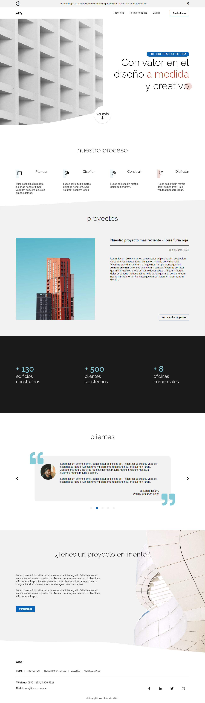

# ARQ · Estudio de arquitectura
Proyecto de página web para un estudio de arquitectura ficticio. Desarrollado con __HTML, SCSS y JavaScript__ para el Curso Full Stack Python de Codo a Codo. Para ver el proyecto en vivo ingresar a: [https://milenagiachetti.github.io/architecture-studio/](https://milenagiachetti.github.io/architecture-studio/).  
  

## Preview del home:  
   

